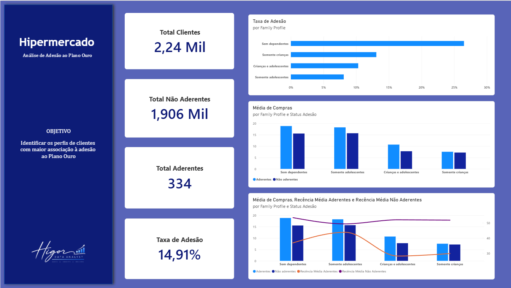

# 🛒 Análise de Adesão ao Plano Ouro — Hipermercado

## 📊 Dashboard

A visualização final foi desenvolvida no Power BI com o objetivo de apresentar os principais padrões identificados durante a análise, facilitando a compreensão dos perfis associados à adesão ao Plano Ouro.

## 📌 Sobre o projeto

Este projeto foi desenvolvido com o objetivo de analisar o comportamento e o perfil dos clientes de um hipermercado para apoiar uma campanha de marketing voltada à adesão de um **Plano Ouro**.

O hipermercado pretende realizar uma campanha por contato telefônico e, como esse tipo de abordagem possui um custo operacional, o objetivo da análise é identificar **quais características e comportamentos estão mais associados à adesão**, permitindo direcionar a campanha para públicos com maior potencial.

A análise considera tanto características demográficas quanto informações relacionadas ao comportamento de compra e relacionamento dos clientes com o hipermercado.

---

## 🎯 Objetivo

Identificar padrões de comportamento e consumo associados à adesão ao Plano Ouro e transformar esses padrões em informações úteis para a estratégia da campanha.

A principal pergunta de negócio que orientou o projeto foi:

> **Quais características diferenciam os clientes que aderiram ao Plano Ouro daqueles que não aderiram?**

A partir dessa pergunta, foram analisados fatores como:

- Perfil familiar;
- Idade;
- Renda;
- Recência de compra;
- Quantidade de compras;
- Canais de compra;
- Consumo por categoria de produto;
- Utilização de promoções;
- Reclamações;
- Resposta à campanha.

---

## 🛠️ Ferramentas utilizadas

- **Python**
- **Pandas**
- **NumPy**
- **Matplotlib**
- **SciPy**
- **Jupyter Notebook**
- **Power BI**
- **Git e GitHub**

---

## 🔎 Etapas da análise

### 1. Preparação dos dados

Inicialmente, foi realizada uma análise da estrutura e qualidade do dataset.

Entre os procedimentos realizados estiveram:

- Padronização dos nomes das colunas;
- Conversão da coluna de data;
- Análise de valores ausentes;
- Investigação de valores extremos;
- Tratamento de um valor extremo identificado na variável de renda;
- Verificação das categorias das variáveis;
- Criação de novas variáveis para auxiliar a análise.

Entre as features criadas durante o projeto estão:

**Perfil familiar (`family_profile`)**

Os clientes foram classificados em quatro grupos:

- Sem dependentes;
- Somente crianças;
- Somente adolescentes;
- Crianças e adolescentes.

**Total de compras (`total_purchases`)**

Foi criada uma variável representando a soma das compras realizadas pelos principais canais:

- Web;
- Catálogo;
- Loja física.

---

## 📊 Análise Exploratória de Dados

A EDA foi conduzida buscando compreender quais características diferenciavam os clientes que aderiram à campanha daqueles que não aderiram.

O dataset apresentou forte diferença entre as classes:

- **Total de clientes:** 2.240
- **Aderentes:** 334
- **Não aderentes:** 1.906
- **Taxa geral de adesão:** aproximadamente 14,91%

Durante a exploração foram analisadas características demográficas, familiares e comportamentais.

### Perfil familiar

A análise indicou diferenças relevantes entre os perfis familiares.

Os clientes **sem dependentes** apresentaram a maior taxa de adesão entre os grupos analisados.

Também foi observado que os perfis **sem dependentes** e **somente adolescentes** apresentaram, de maneira geral, maior volume médio de compras quando comparados aos demais grupos.

Esses padrões tornaram o perfil familiar uma característica relevante para compreender o comportamento dos clientes, embora essa variável não tenha sido submetida a um teste estatístico neste projeto.

### Comportamento de compra

Ao comparar aderentes e não aderentes, foram observados padrões importantes relacionados à atividade dos clientes.

De maneira geral, os clientes que aderiram apresentaram:

- Maior quantidade média de compras;
- Compras mais recentes;
- Maior atividade em diferentes canais de compra.

Os perfis sem dependentes e somente adolescentes também apresentaram maior consumo médio em diversas categorias de produtos.

### Recência

A variável `Recency` representa a quantidade de dias desde a última compra realizada pelo cliente.

Valores menores indicam uma compra mais recente.

Durante a EDA, os clientes aderentes apresentaram, de maneira consistente, menor recência quando comparados aos não aderentes em diferentes perfis familiares.

Esse padrão levantou a hipótese de que clientes com relacionamento de compra mais recente poderiam apresentar comportamento diferente em relação à adesão à campanha.

### Reclamações

Também foi analisado o histórico de reclamações (`Complain`).

A proporção de clientes com reclamações registradas foi muito baixa nos dois grupos:

- Não aderentes: aproximadamente **0,94%**
- Aderentes: aproximadamente **0,90%**

Como as proporções são praticamente equivalentes, a variável não apresentou um padrão relevante para diferenciar aderentes e não aderentes durante a análise exploratória.

---

## 🧪 Testes de hipótese

Após a EDA, alguns dos padrões encontrados foram avaliados estatisticamente.

Foi utilizado um nível de significância de:

**α = 0,05**

Para as variáveis numéricas analisadas, foi utilizado o **teste de Mann-Whitney**, comparando os clientes aderentes e não aderentes.

### Hipótese 1 — Recência × Adesão

**H₀:** Não existe diferença estatisticamente significativa na distribuição da recência entre clientes aderentes e não aderentes.

**H₁:** Existe diferença estatisticamente significativa na distribuição da recência entre clientes aderentes e não aderentes.

O teste apresentou **p-value inferior ao nível de significância de 5%**.

Portanto, **H₀ foi rejeitada**.

Existe evidência estatística de diferença na recência entre clientes aderentes e não aderentes.

Esse resultado sustenta o padrão observado durante a EDA, em que os clientes aderentes apresentaram compras mais recentes.

---

### Hipótese 2 — Total de compras × Adesão

**H₀:** Não existe diferença estatisticamente significativa na distribuição do total de compras entre clientes aderentes e não aderentes.

**H₁:** Existe diferença estatisticamente significativa na distribuição do total de compras entre clientes aderentes e não aderentes.

Novamente, o teste apresentou **p-value inferior ao nível de significância de 5%**.

Portanto, **H₀ foi rejeitada**.

Existe evidência estatística de diferença no total de compras entre clientes aderentes e não aderentes.

O resultado reforça a descoberta exploratória de que o histórico de compras apresenta diferenças entre os dois grupos.

---

## 💡 Principais insights

A análise permitiu identificar alguns padrões relevantes para a estratégia da campanha.

Clientes que aderiram ao Plano Ouro apresentaram, de maneira geral, **maior histórico de compras e compras mais recentes** quando comparados aos clientes que não aderiram.

Os testes estatísticos realizados forneceram evidências de que as diferenças observadas em **recência e total de compras** não se limitaram apenas às diferenças encontradas visualmente durante a EDA.

Além disso, a análise exploratória mostrou que clientes **sem dependentes** apresentaram a maior taxa de adesão entre os perfis familiares analisados.

Os perfis **sem dependentes** e **somente adolescentes** também apresentaram maior volume médio de compras, tornando esses grupos relevantes para a estratégia de segmentação.

Por outro lado, o histórico de reclamações apresentou proporções praticamente iguais entre aderentes e não aderentes e não demonstrou um padrão relevante para explicar a adesão.

---

## 📈 Dashboard

Os principais resultados da análise foram consolidados em um dashboard desenvolvido no **Power BI**, permitindo visualizar:

- Total de clientes;
- Total de aderentes e não aderentes;
- Taxa geral de adesão;
- Taxa de adesão por perfil familiar;
- Média de compras por perfil;
- Comparação entre aderentes e não aderentes;
- Relação entre comportamento de compra e recência.

---

## 🎯 Conclusão

A análise indica que o comportamento recente e o histórico de compras são características importantes para diferenciar clientes aderentes e não aderentes à campanha.

Clientes que realizaram compras mais recentemente e que possuem maior histórico de compras apresentaram padrões mais favoráveis à adesão, e essas diferenças também encontraram suporte nos testes estatísticos realizados.

A análise exploratória também destacou o perfil familiar, principalmente clientes **sem dependentes**, que apresentaram a maior taxa de adesão observada no conjunto de dados.

Dessa forma, uma estratégia de segmentação da campanha pode considerar principalmente o **nível de atividade recente do cliente, seu histórico de compras e os padrões observados entre os diferentes perfis familiares**, priorizando públicos que apresentaram comportamento mais semelhante aos clientes que já aderiram.

Os resultados representam **associações encontradas nos dados analisados e não relações causais**, servindo como suporte para a tomada de decisão do time de marketing.

---

## 👨‍💻 Autor

**Higor — Data Analyst**

Projeto desenvolvido como parte do meu portfólio de Análise de Dados.